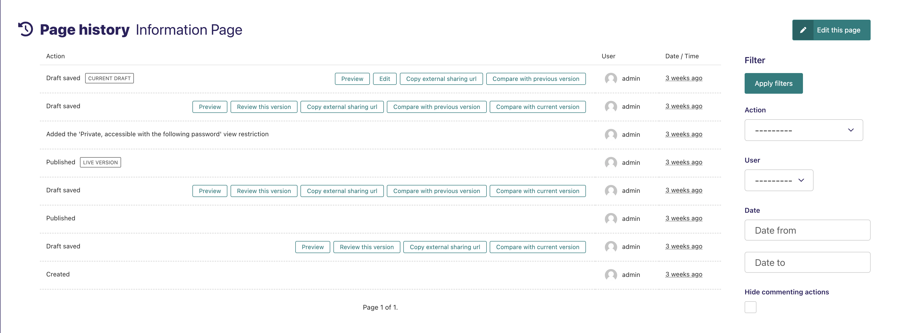
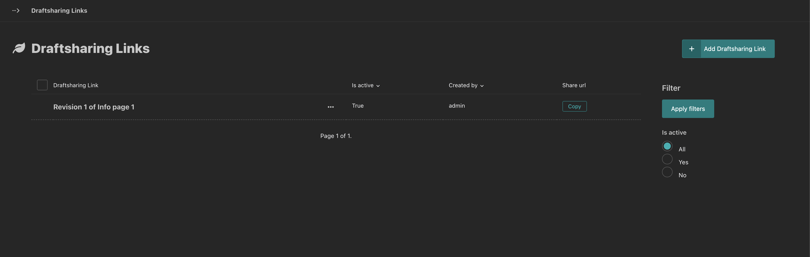
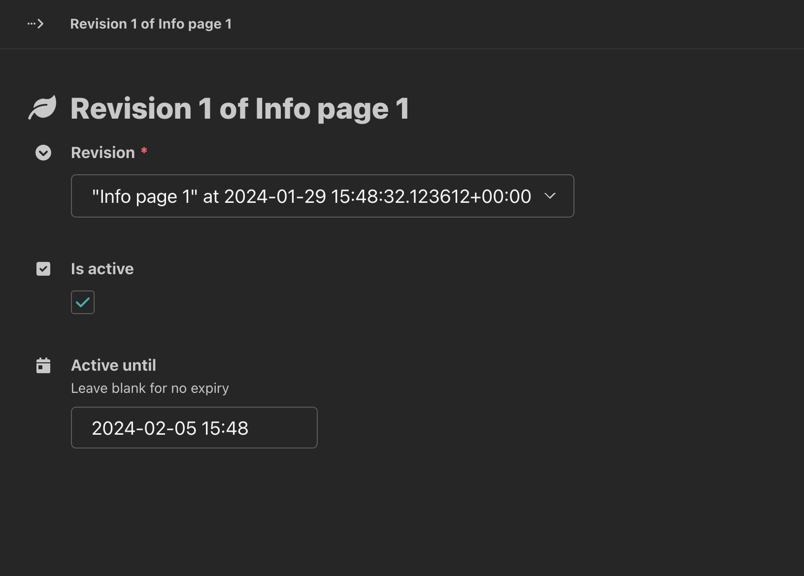
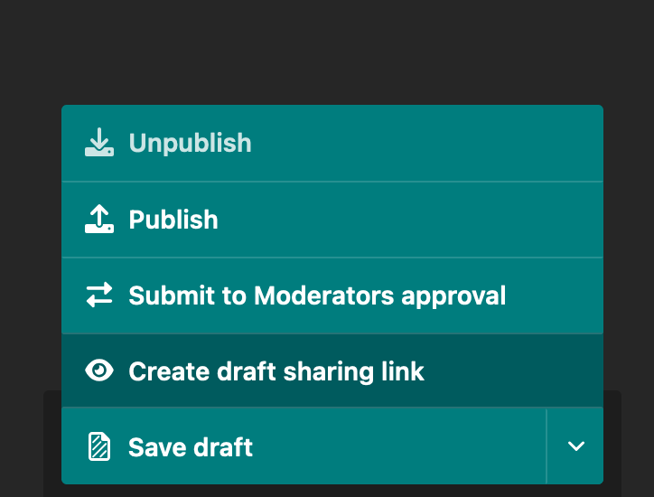

wagtaildraftsharing
===============

Share [Wagtail](https://wagtail.io) drafts with private URLs.

``wagtaildraftsharing`` makes it easier to share Wagtail draft content for review by users who don't have access to the Wagtail admin site. It allows you to generate random urls to expose the revisions of your Wagtail pages.

## Setup

Install the package using pip:

```bash
pip install wagtaildraftsharing
```

Add ``wagtaildraftsharing`` as an installed app in your Django settings:

```python
# in settings.py
INSTALLED_APPS = (
    ...
    'wagtaildraftsharing',
    'wagtail.admin',
    ...
)
```

Since ``wagtaildraftsharing`` overrides one of the ``wagtail.admin`` templates, it must be listed before ``wagtail.admin`` in the ``INSTALLED_APPS`` list.

This package also makes use of ``wagtail.snippets``, so it must be included in your list of installed apps.

You must also have ``USE_TZ=True`` in your project settings to ensure expiry datetimes are all referencing the expected timezone - from Django 5, this defaults to ``True``, whereas previously it was ``False``.

Run migrations to create the required database tables:

```bash
python manage.py migrate wagtaildraftsharing
```

Add the ``wagtaildraftsharing`` urls to your ``urls.py``:

```python
# in urls.py
import wagtaildraftsharing.urls as wagtaildraftsharing_urls

urlpatterns += [
    path("wagtaildraftsharing/", include(wagtaildraftsharing_urls)), # or whatever url you want
]
```

Each draft in the history page for any page (/admin/pages/\<id\>/history/) will now have an additional action - ``Copy external sharing url``. Clicking this will generate a random url (and copy it to the clipboard) that can be shared with anyone. The url will display the draft version of the page.



All generated links can be viewed at ``/admin/wagtaildraftsharing/``.



Each link can be edited to expire at a certain date, or to be disabled immediately.



In addition, it you can also make a sharing link directly from the Action Menu at the bottom of a page being edited, as long as there is a
draft version saved since the last time the page was published



## Settings

The following settings can be added to your Django settings file as keys in a `WAGTAILDRAFTSHARING` dictionary

```
WAGTAILDRAFTSHARING = {
    ...
    "MAX_TTL": 123456,
    ...
}
```

### ``MAX_TTL``

The default expiry time for generated links, in seconds. Defaults to 28 days. Set it to a negative value to disable expiry.

### ```ADMIN_MENU_POSITION```

Set the integer priority to control where in the admin menu
the link to the list of generated links sits. Defaults to 200.

### ```VERBOSE_NAME```

Provide a different singular label for a link. Defaults to "Draftsharing Link"

### ```VERBOSE_NAME_PLURAL```

Provide a different plural label for a link. Defaults to "Draftsharing Links"

### ```MENU_ITEM_LABEL```

Customise the label used in the page-level Action Menu for creating a link. Defaults to "Create draft sharing link",

## Testing

To install testing dependencies locally run `pip install -e ".[testing]"`
